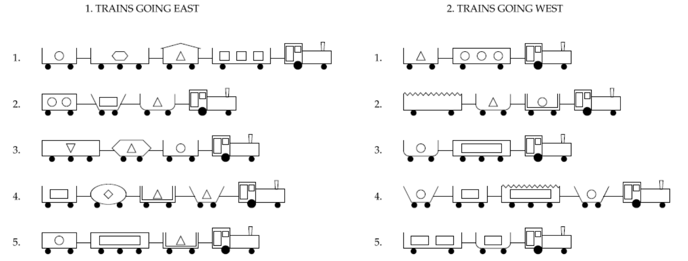

# NeuralSymbolic-Demo

* run `NeuralSymbolic_Demo.ipynb` on google colab or localy with jupyter notebook

## Michalski’s train problem

* Assume ten railway trains: five are travelling east and five are travelling west; each train comprises a locomotive pulling wagons; whether a particular train is travelling towards the east or towards the west is determined by some properties of that train

 
* The learning task: determine what governs which kinds of trains are Eastbound and which kinds are Westbound

[reference](https://slidewiki.org/presentation/1030-1/michalski's-train-problem/1030-1/8650-2/?locale=pt#/slide-8650-2)